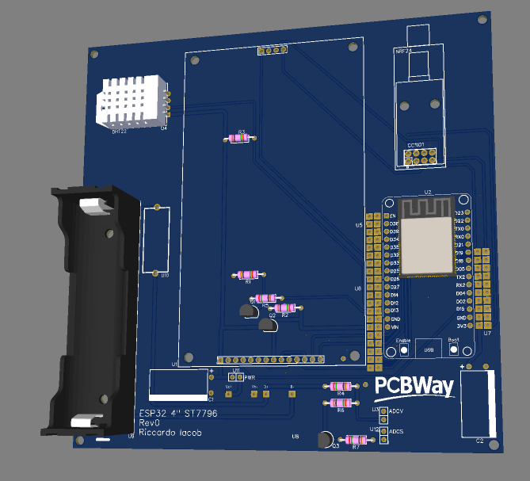

Please use the ["Discussions"](https://github.com/riacob/TFTFXLib/discussions) facility for Q&A and such. Use the ["Issues"](https://github.com/riacob/TFTFXLib/issues) section only for bug reports and problems with the library. Thank you!

## Hardware
Work in progress OSS/OSHW development board [available here](https://oshwlab.com/iacob.riccardo/esp32_tft_4inch)

Currently waiting for PCBWay to process the order. Updates will follow.

## TFTFXLib
The idea of this library is to provide UI/UX functionality for [Bodmer's TFT_eSPI](https://github.com/Bodmer/TFT_eSPI) library.
 
It allows its users to easily create and manage new screens, which can contain numerous widgets, such as buttons, switches, checkboxes, graphs, indicators..
 
Everything is integrated with the TFT LCD's touch functionality, allowing for the creation of complex menu systems and data visualizers.
 
The library is still in early development. The documentation is available [here](https://github.com/riacob/TFTFXLib/tree/main/docs/).
 
The user-editable files are organized using codeguards. In each dedicated section of the documentation, the user will be able to read how each section of the code is meant to work and how it has to be implemented.

## Contributing
Users are more than welcome to contribute, testing the library and introducing new widgets! Just submit a pull request with your widget or fix, and you will be credited in the code and here!
 
Maybe check out [the TODO list](https://github.com/riacob/TFTFXLib/tree/main/docs/TODO.md) if you want to contribute to my ideas. Make sure to check that the idea wasn't already developed and I forgot to remove it, but, if that's the case, and if you think your implementation might be better, feel free to submit it.

## Credits
Huge thanks to [Bodmer](https://github.com/Bodmer), without who this library wouldn't have been possible.
Thanks to all the sponsors for supporting this project.
Thanks to all my friends who helped me test and debug the project.

## Sponsors
### [PCBWay](https://pcbway.com/g/745Je3)
Thanks to excellent service and quality for providing the PCBs for this project.
